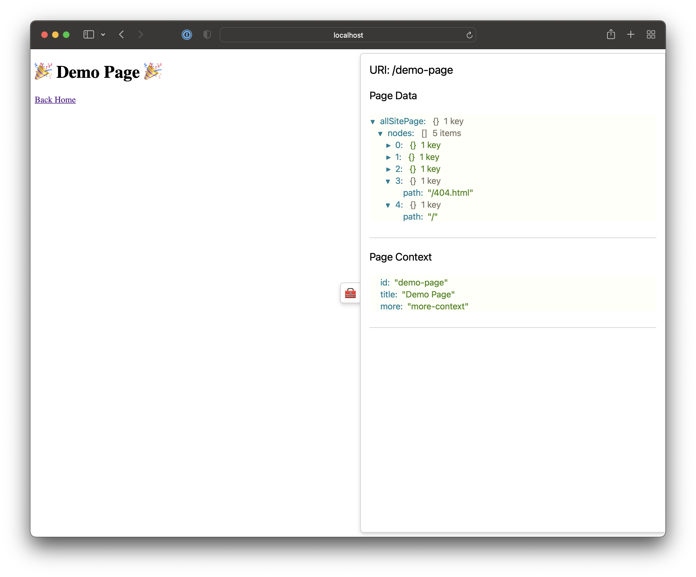

# Gatsby plugin page data preview

> A little helper plugin that visualises your Gatsby Page Data in a super handy pullout blade.

- Page Data
- Page Context
- SSR Data



View it in action here: [Demo Link](https://pagedatapreview.gatsbyjs.io/demo-page)

## How to install

`npm install gatsby-plugin-page-data-preview`

or

`yarn add gatsby-plugin-page-data-preview`

## How to use

```
module.exports = {
  plugins: [
    {
      resolve: `gatsby-plugin-page-data-preview`,
      options: {
        onlyDev: false, // defaults to true (only show in develop)
      },
    },
  ],
}
```

## Questions, Feedback and Suggestions

If you have any questions, feedback or suggestions head on over to [discussions](https://github.com/ashhitch/gatsby-plugin-page-data-preview/discussions).

## Found a bug?

If you find a bug please open an [issue](https://github.com/ashhitch/gatsby-plugin-page-data-preview/issues) and/or create a pull request to fix it.
